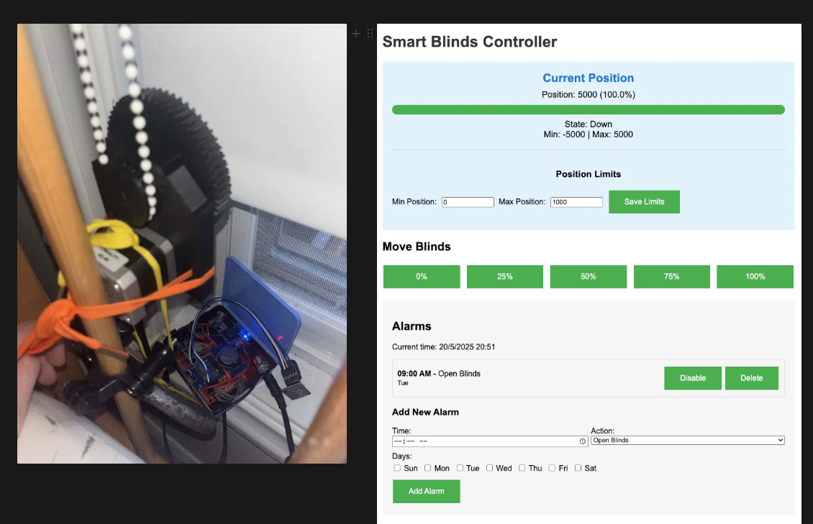

# xBlinds - Smart Motorized Blinds Controller

An open-source smart blinds controller built on the ESP8266. Control your roller blinds via a web interface, scheduled alarms, rotary encoder, or Home Assistant integration.



## Features

- **Web Interface** - Responsive UI with real-time position display, preset buttons (0/25/50/75/100%), and position limit configuration
- **Scheduled Alarms** - Set up to 10 alarms to automatically open or close blinds on specific days and times
- **Rotary Encoder** - Manual control directly on the unit with push-button support
- **NTP Time Sync** - Automatic clock synchronization from the internet
- **WiFi with AP Fallback** - Connects to your home WiFi, falls back to an access point if unavailable
- **mDNS** - Access the controller at `http://blinds.local`
- **EEPROM Persistence** - Saves position, limits, and alarms across reboots
- **ESPHome Support** - Alternative ESPHome configurations for Home Assistant integration

## Hardware

| Component | Description |
|-----------|-------------|
| **Microcontroller** | ESP8266 D1 Mini (AZDelivery or similar) |
| **Stepper Motor** | 28BYJ-48 5V with ULN2003 driver board |
| **RTC Module** | DS3231 I2C real-time clock with battery backup |
| **Rotary Encoder** | With push button (KY-040 or similar) |
| **Power Supply** | 5V 2A (do **not** power via USB alone) |

> Alternative: NEMA17 stepper motor with A4988 driver (see `software/nema17/`)

### Wiring

| ESP8266 Pin | Connection |
|-------------|------------|
| D1 | Encoder DT |
| D2 | Encoder CLK |
| D3 | I2C SCL (RTC) |
| D4 | I2C SDA (RTC) |
| D5 | Stepper DIR |
| D6 | Stepper STEP |
| D7 | Encoder Button |

## Getting Started

### 1. Configure WiFi

Edit `software/blinds_controller/blinds_controller.ino` and set your WiFi credentials:

```cpp
const char* ssid = "YOUR_WIFI_SSID";
const char* password = "YOUR_WIFI_PASSWORD";
```

### 2. Build and Upload

Using Arduino CLI:

```bash
# Compile
arduino-cli compile --fqbn esp8266:esp8266:d1_mini software/blinds_controller/blinds_controller.ino

# Upload (adjust port for your system)
arduino-cli upload -p /dev/cu.usbserial-110 --fqbn esp8266:esp8266:d1_mini software/blinds_controller/blinds_controller.ino

# Monitor serial output
arduino-cli monitor -p /dev/cu.usbserial-110 -c baudrate=115200
```

Or use the build script:

```bash
cd software
./build.sh -a  # Build, upload, and monitor
```

### 3. Connect

Once running, the controller is accessible at:
- `http://blinds.local` (via mDNS)
- The IP address shown in the serial monitor

If WiFi connection fails, it creates an open access point with SSID `blinds`.

### 4. Set Position Limits

Use the web UI to configure the min and max positions for your blinds, then save. The controller remembers these across reboots.

## API Endpoints

| Endpoint | Method | Description |
|----------|--------|-------------|
| `/` | GET | Web interface |
| `/api/status` | GET | Position, state, limits, network info |
| `/api/moveto?percentage=N` | GET | Move to position (0-100%) |
| `/api/alarms` | GET | List all alarms |
| `/api/alarms` | POST | Add, delete, or toggle alarms |
| `/api/time` | GET/POST | Get or set RTC time |
| `/api/sync-ntp` | GET | Sync clock from NTP |
| `/api/setup?action=X` | GET | Setup mode (start/stop/save/status) |

## ESPHome Alternative

If you prefer ESPHome over custom firmware, configurations are available in:
- `software/blinds.yaml` - Basic ESPHome config
- `esphome/stepper.yaml` - Stepper motor config with Home Assistant integration

## 3D Printed Parts

STL and 3MF files for the enclosure and gears are in the `mechanical/` directory. Designed in FreeCAD.

## Project Structure

```
xblinds/
├── software/
│   ├── blinds_controller/    # Main firmware (recommended)
│   ├── stepper/              # AccelStepper variant
│   ├── nema17/               # NEMA17 motor variant
│   ├── demo_step/            # Basic stepper test
│   ├── blinds.yaml           # ESPHome config
│   └── build.sh              # Build/upload script
├── esphome/                  # ESPHome configurations
├── mechanical/               # 3D models (STL, 3MF, STEP)
└── examples/                 # Reference projects and configs
```

## Dependencies

- [ESP8266 Arduino Core](https://github.com/esp8266/Arduino)
- [RTClib](https://github.com/adafruit/RTClib) - DS3231 RTC support
- [Encoder](https://github.com/PaulStoffregen/Encoder) - Rotary encoder library
- [NTPClient](https://github.com/arduino-libraries/NTPClient) - NTP time sync

## License

This project is open source. Original xBlinds concept from [Thingiverse](https://www.thingiverse.com/thing:4792584).
